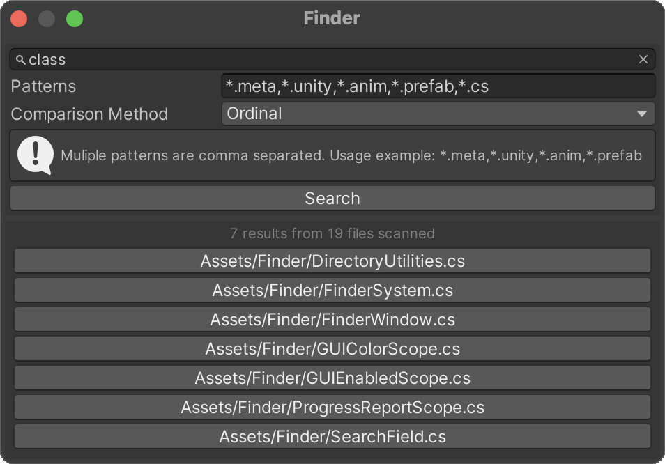

# Finder
### Fast multi-thread find in files system for unity

- Helps you to find those implicit method usages that IDEs such as rider cannot find by file indexing
- Search progress happens asynchronously and does not block you to work
- Reports current progress
- Scan 40.000 files (*.meta, *.anim, *.unity, *.prefab) in less than 5 seconds (Tested on Ryzen 5600X)
- Takes fully advantage of your cores, scaling in speed as you have more cores ;) 

## Install via UPM (using Git URL)
```
https://github.com/gustavopsantos/finder.git?path=/Assets/Finder/#1.0.0
```

## Problem
[Unity](https://unity.com/) allow us to assign public instance methods invokation to UnityEvents, EventTriggers, Buttons, Animation Events and more.
And some of those implicit usages cannot be found by JetBrains Rider.
So when refactoring legacy code, its a pain to know if a apparently non-used method is truly not being used, or just being invoked implicitly.

## Solution
In the past I was using [notepad++](https://notepad-plus-plus.org/) to find those usages, but for larger projects, as notepad++ find in files is single threaded, it just takes to much.
So I decided to design a robust finder that could help in those cases.
